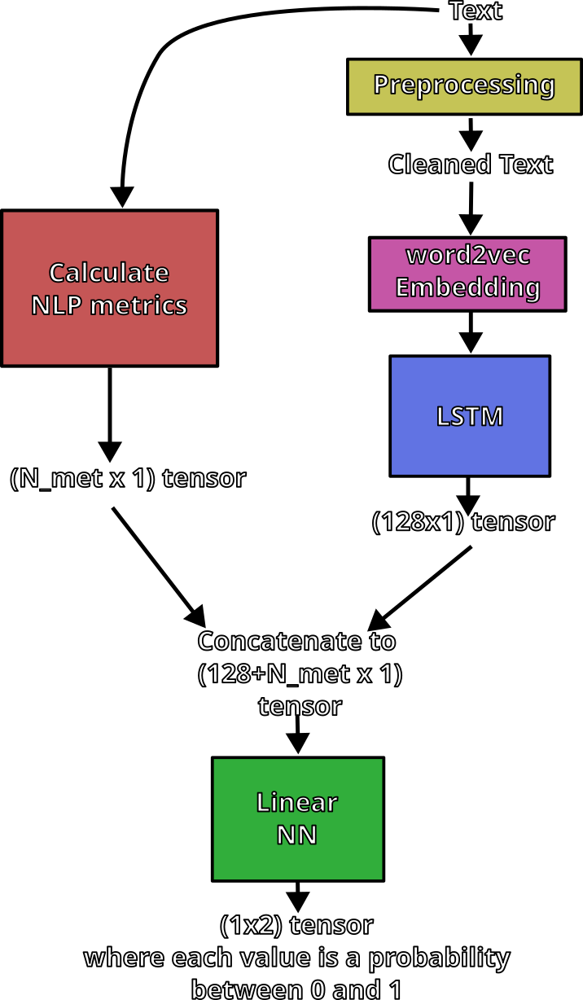

# ChatGPT_Detect

## Application Link:
The current form of the application is available at this link:

Please note: This is a temporary server so the application may not be accessible long-term after the completion of this project.

## Repository Layout
- application : code required to run the final application
- data : data used in this project
- essay_generator : scripts and notebooks used to query the Chat GPT API to construct the GPT part of the dataset
- metrics : exploration of different possible natural language processing metrics to be included in the model
- training : all work used for training the model

## Model Architecture

